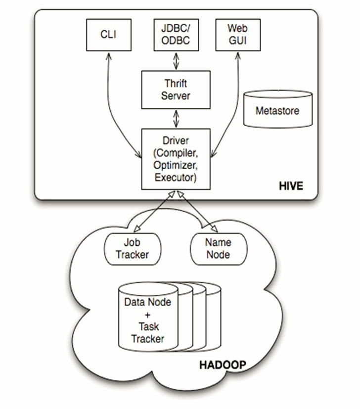
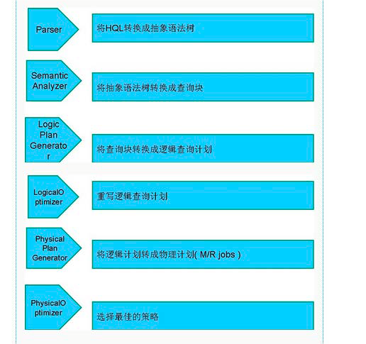

Hive：数据仓库 
Hive：解释器，编译器，优化器等。 
Hive运行时，元数据存储在关系型数据库里面。 

Hive的架构： 
 
(1)用户接口主要有三个：CLI，Client 和WUI。其中最常用的是CLI，CLI启动的时候，会同时启动一个Hive副本。Client是Hive的客户端，用户连接至HiveServer。在启动Client模式的时候，需要指出Hive Server所在节点，并且在该节点启动Hive Server。WUI是通过浏览器访问Hive。 
(2)Hive将元数据存储在数据库中，如mysql、derby。Hive中的元数据包括表的名字，表的列和分区及其属性，表的属性（是否为外部表等），表的数据所在目录等。 
(3)解释器、编译器、优化器完成HQL查询语句从词法分析、语法分析、编译、优化以及查询计划的生成。生成的查询计划存储在HDFS中，并在随后有MapReduce调用执行。 
(4)Hive的数据存储在HDFS中，大部分的查询、计算由MapReduce完成（包含*的查询，比如select * from tbl不会生成MapRedcue任务）。 

- 编译器将一个Hive QL转换操作符
- 操作符是Hive的最小的处理单元
- 每个操作符代表HDFS的一个操作或者一道MapReduce作业

ANTLR词法语法分析工具解析HQL 
 

Hive的三种模式：
- 单用户模式。此模式连接到一个In-memory的数据库Derby，一般用与Unit Test.
- 单用户模式。通过网络连接到一个数据库中，是最经常使用到的模式。
- 远程服务器模式(多用户模式)。用于非Java客户端访问元数据库，在服务器端启动MetaStoreServe，客户端利用Thrift协议通过MetaStoreServer访问元数据库。 
  服务端启动：hive --service metastore 
  客户端：hive 